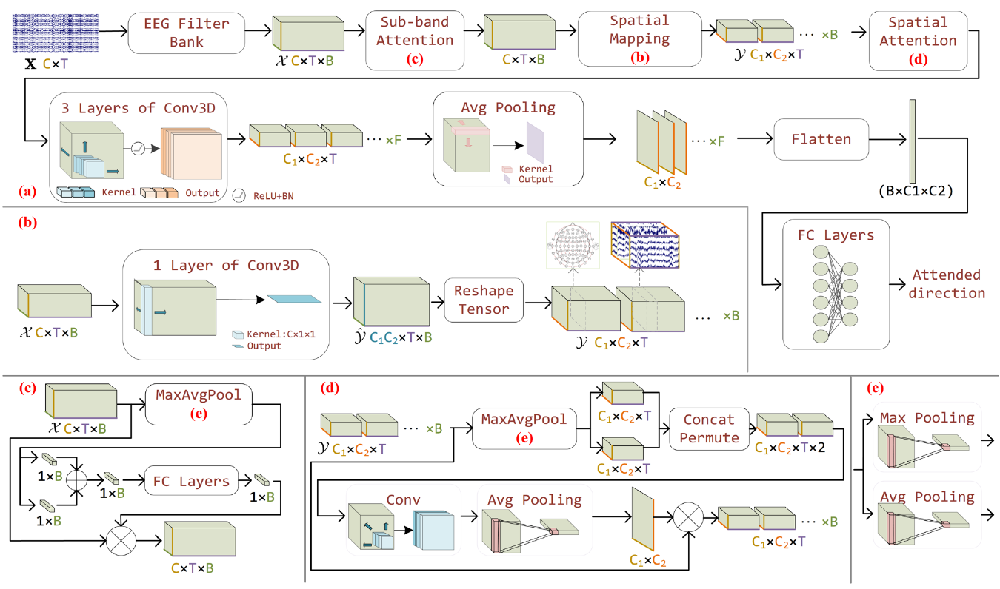
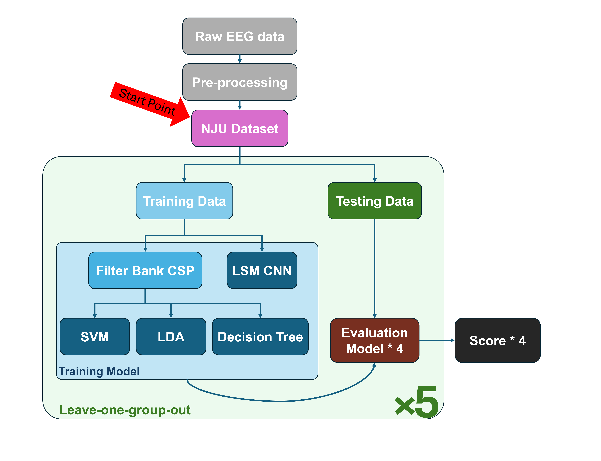
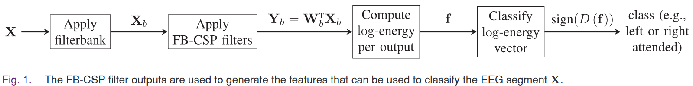

# Data Description

## _Experimental Design_

## _Data Collection_

## _Qulity Evaulation_

# BCI Framework

This project marks our initial exploration into EEG-based Auditory Attention Decoding (AAD) and the NJU Dataset. As a starting point, we implemented previously established methods to build a foundation for our analysis.

We selected two approaches that serve as the core components for feature extraction and classification in our BCI project.

1. Filter Bank CSP
   
    The Common Spatial Pattern (CSP) technique has been widely used in AAD tasks [2–6] due to its ability to separate attention-related neural patterns. Filter Bank CSP further enhances this by applying CSP across multiple frequency bands. In the work of Geirnaert et al. [1], FB-CSP was combined with a Linear Discriminant Analysis (LDA) classifier to decode auditory attention direction. Their method achieved 90.5% accuracy in classifying between ±90° directions using both the KUL dataset and their in-house dataset.

2. Learnable Spatial Mapping CNN
   
   > 
    
    The method proposed by Zhang et al. [7] is the first to introduce and analyze the NJU dataset, which is the same dataset we use in this project. As the dataset creators, their work provides an important baseline for future research on auditory attention decoding under more complex spatial conditions. For this reason, we selected their approach as our baseline method.

    Their model introduces a Learnable Spatial Mapping (LSM) mechanism, which projects EEG channel signals into a 2D spatial structure, allowing convolutional layers to more effectively capture inter-channel spatial relationships. This spatial transformation allows convolutional layers to more effectively extract inter-channel patterns relevant to the listener’s directional attention.

While both studies made valuable contributions, they did not investigate subject dependency. To address this, our analysis employs a subject-independent evaluation strategy, using leave-one-group-out cross-validation to assess the model's robustness across different individuals.

## Workflow

Since the NJU dataset we use in this study has already undergone preprocessing—and our prior inspection confirmed minimal artifacts and high signal quality; therefore, we did not apply further preprocessing. Instead, we proceed directly with the analysis. 

Before feeding the data into our models, we segment the EEG signals based on different decision window lengths, which allows us to explore how temporal resolution impacts classification performance.

Unlike the original FB-CSP study [1], which employed only LDA as a classifier, we extend the comparison by including SVM and Decision Tree classifiers. As a result, we evaluate four models in total:
   - FB-CSP + LDA
   - FB-CSP + SVM
   - FB-CSP + Decision Tree
   - LSM CNN (from [7])

For validation, we adopt a leave-one-group-out strategy. We first estimate the number of trials per subject and divide the entire dataset into five groups, maintaining an approximately equal distribution. Each subject appears in only one group, ensuring that the training and validation sets are composed of trials from non-overlapping subject groups. This setup allows us to assess model performance in a subject-independent manner.

> 
>Figure: Overview of our experimental pipeline.
The workflow begins with EEG signals that have already been preprocessed by the NJU dataset providers. These signals are first segmented according to different decision window lengths (e.g., 0.5s, 1s, 2s). The segmented data are then fed into two parallel pipelines:
> 1. FB-CSP Pathway: Each segment is filtered into multiple frequency bands using a filter bank. Common Spatial Pattern (CSP) is then applied to extract spatial features from each band. The resulting log-variance features are concatenated and used as input for classical machine learning classifiers such as LDA, SVM, and Decision Tree.
> 2. LSM-CNN Pathway: EEG segments are directly fed into the Learnable Spatial Mapping Convolutional Neural Network, which first transforms the 1D EEG channel signals into a 2D spatial map, followed by several convolutional layers to learn attention-relevant patterns. 
> 
>Finally, classification is performed, and accuracy is evaluated using a subject-independent Leave-One-Group-Out (LOGO) cross-validation strategy.

## _Feature Extraction - Filter Bank Common Spatial Pattern_

> 

FB-CSP is an extension of the Common Spatial Pattern (CSP) technique, which is widely used in EEG signal classification. Instead of applying CSP on a single frequency band, FB-CSP decomposes EEG signals into multiple frequency bands using a filter bank, then applies CSP separately on each band. For each band, we selected 4 spatial components (i.e., the most discriminative CSP filters) to extract relevant features. The resulting spatially filtered signals are then transformed into log-variance features and concatenated into a single feature vector for classification.

## _LSM CNN - Training Details_

To ensure a fair comparison, the training segments fed into the LSM CNN are identical to those used in the FB-CSP pipeline. The model architecture and codebase are based on the official implementation provided by the dataset authors [[GitHub Repository]](https://github.com/NCA-Lab/learnable_spatial_mapping) as introduced by Zhang et al. [6].

The model is trained using the Adam optimizer with a learning rate of 1e-4. We use a batch size of 64 and a total maximum of 100 epochs. To prevent overfitting, an early stopping mechanism is applied with a patience of 30 epochs based on validation loss. Each fold in the leave-one-group-out cross-validation follows this training configuration.

## ___Experimental Design___

Our experiments are structured around three key classification tasks, each targeting a different aspect of auditory attention decoding performance. These tasks aim to evaluate model robustness and identify the most suitable configuration for potential use in a real-world BCI system.

### 1. Auditory Attention Direction Classification
   
We assess the model's ability to classify the direction of auditory attention using only left vs. right trials with symmetric angular offsets. We evaluate five combinations of speaker angles:

- All symmetric angles
- ±90°
- ±60°
- ±45°
- ±30°

### 2. Frequency Band Comparison for CSP-based Feature Extraction

To identify the most effective frequency range, we compare classification performance across:

 - Single-band CSP (delta, theta, alpha, beta)

 - Two FB-CSP configurations:

   1. 2–40 Hz (14 bands, 4 Hz width, 2 Hz overlap)

    2. 12–22 Hz (4 bands, 4 Hz width, 2 Hz overlap)

### 3. Effect of Decision Window Length
    
We examine how different decision window lengths affect classification accuracy, aiming to find a balance between fast detection and model performance—critical for real-time BCI applications.

The goal across all experiments is to identify the optimal configuration—in terms of frequency band, temporal resolution, and classification setting—for building a robust and responsive BCI system based on EEG auditory attention decoding.

## ___Validation_ - Leave One Group Out__

Due to the randomized angle assignment in the NJU dataset, each subject has a different number of trials for each direction. As a result, it's not feasible to ensure a fixed ratio of angles across all subjects during grouping. To address this, we divided subjects into five groups and applied a Leave-One-Group-Out (LOGO) validation strategy. We aimed to keep the groups consistent across experiments while also minimizing imbalances in the number of trials per angle.
Specifically, the groups were formed based on subject IDs as follows: Group 1 (S02–S07), Group 2 (S09, S12, S13, S15), Group 3 (S16–S19), Group 4 (S21–S23), and Group 5 (S25–S27).

The following table shows the percentage distribution of trial segments per angular condition within each group:

| Group (Subjects) | Group 1 (S02~S07) | Group 2 (S09~S15) | Group 3 (S16~S19) | Group 4 (S21~S23) | Group 5 (S25~S27) |
|:-:|:-:|:-:|:-:|:-:|:-:|
|All (6755)|21.3%|17.3%|21.0%|21.9%|18.4%|
|±90° (1172)|13.9%|12.9%|14.1%|31.4%|27.7%|
|±60° (1235)|13.9%|12.0%|15.6%|28.0%|30.4%|
|±45° (1205)|15.4%|13.4%|14.5%|31.3%|25.4%|
|±30° (1141)|17.2%|13.4%|14.5%|33.9%|20.9%|

For the final accuracy calculation, we compute the classification accuracy at the segment level. However, to report variability, we compute the standard deviation across the five validation groups based on their individual accuracy scores.

## _Usage_

### FB-CSP  
To run the FB-CSP experiments, please refer to the `FB_CSP_classify.ipynb` notebook. The following Python packages are required:  
- `mne`  
- `scikit-learn`  
- `h5py`  

### Learnable Spatial Mapping (LSM-CNN)  
The code for the LSM-CNN model is based on the official implementation from the [Learnable Spatial Mapping GitHub Repository](https://github.com/NCA-Lab/learnable_spatial_mapping).  

Our experiments can be reproduced using the `train_lsm.ipynb` notebook. Please ensure `PyTorch` is properly installed before running this notebook.

## _Demo Video_
For a quick demonstration of our workflow, dataset processing, and model training steps, please refer to the demo video linked below.  
It walks through the major components of the pipeline and provides an overview of how to reproduce the experiments.

 [🔗 Demo Video](https://drive.google.com/file/d/1EmUWOP9_lxkcY6vVsJ9Sfho_BpuO9uCv/view?usp=sharing)

## _Result_

### 1. **Different Direction**

| Direction (Segment Count) | FB CSP + SVM | FB CSP + LDA | FB CSP + Decision Tree | Learnable Sptail Mapping CNN|
|:-:|:-:|:-:|:-:|:-:|
| All (6755)|49.5±1.4|48.8±2.6|48.6±1.7|54.4±1.7|
| ±90° (1172)|**62.4±6.6**|**57.1±3.3**|**58.0±4.5**|**58.6±4.6**|
| ±60° (1235)|47.9±5.3|48.9±6.6|47.4±5.6|53.3±2.1|
| ±45° (1205)|40.7±5.6|44.2±7.1|48.6±11.0|52.8±3.1|
| ±30° (1141)|38.6±10.0|35.8±11.0|44.7±6.5|52.6±3.1|

As the angular distance between competing speakers decreases, the classification task becomes more challenging. The drop in accuracy across all models—particularly the CSP-based methods—highlights this difficulty. Among all models, the SVM classifier with FB-CSP shows a clear advantage at ±90°, achieving 62.4% accuracy, outperforming other classifiers by 4–5%.

### 2. **±90° Classification with Different CSP Frequency Bands**

| Frequency Band (1172 segments) | FB CSP + SVM | FB CSP + LDA | FB CSP + Decision Tree |
|:-:|:-:|:-:|:-:|
|Filter Bank (1~40, 14 Bands)|58.0±8.4|56.2±8.5|56.2±11.1|
|1−4 Hz (δ)|55.5±3.3|52.6±3.3|52.2±6.4|
|4−8 Hz (θ)|56.1±3.0|55.0±2.3|54.4±4.6|
|8−12 Hz (α)|54.0±9.6|**57.9±7.4**|56.7±5.8|
|12~20 Hz|**66.2±7.5**|56.7±5.9|53.2±7.5|
|Filter Bank (12~22, 4 Bands)|62.4±6.6|57.1±3.3|**58.0±4.5**|
|12−30 Hz (β)|56.7±1.6|57.7±9.1|57.3±8.3|

Using a single CSP band in the 12–20 Hz range with SVM yields the highest accuracy at 66.2%, with relatively stable performance across validation groups. The 12–22 Hz filter bank configuration also performs well across all classifiers, suggesting that this narrower band is particularly informative for AAD classification.

### 3. **Effect of Decision Window Length**

| Window Size (Segment Count) | FB CSP + SVM | FB CSP + LDA | FB CSP + Decision Tree | Learnable Sptail Mapping CNN|
|:-:|:-:|:-:|:-:|:-:|
|10 (476)|**63.4±8.0**|58.4±6.9|51.7±6.9| x |
|4 (1172)|**62.4±6.6**|57.1±3.3|58.0±4.5|60.6±+6.7|
|2 (2380)|**59.3±6.7**|56.6±3.5|55.8±6.7|59.2±5.5|
|1 (4760)|**57.7±6.8**|56.6±3.2|56.8±5.5|55.6±5.2|

Due to the high memory demand of the LSM CNN model, we were unable to complete the experiment with a 10-second decision window.

Generally, longer windows improve classification accuracy, especially for the SVM and LDA classifiers. However, 4-second windows strike a good balance between accuracy and computational efficiency, making them a practical choice for real-time BCI systems.

## Overall Observations

Overall, under the Leave-One-Group-Out (LOGO) validation strategy, the FB-CSP method demonstrates more stable and superior classification performance compared to the LSM CNN model. In addition, FB-CSP is more computationally efficient and requires fewer resources. Using a 12–22 Hz filter bank with a 4-second decision window offers a good balance between accuracy and practicality, making FB-CSP a promising approach for real-world BCI system implementation.

## Reference

1. Geirnaert, S., Francart, T., & Bertrand, A. (2020). Fast EEG-based decoding of the directional focus of auditory attention using common spatial patterns. IEEE Transactions on Biomedical Engineering, 68(5), 1557-1568.
2. Yang, K., Xie, Z., Di Zhou, L. W., & Zhang, G. (2023). Auditory attention detection in real-life scenarios using common spatial patterns from eeg. In INTERSPEECH.
3. Cai, S., Su, E., Song, Y., Xie, L., & Li, H. (2020, October). Low Latency Auditory Attention Detection with Common Spatial Pattern Analysis of EEG Signals. In INTERSPEECH (pp. 2772-2776).
4. Rotaru, I., Geirnaert, S., Heintz, N., Van de Ryck, I., Bertrand, A., & Francart, T. (2024). What are we really decoding? Unveiling biases in EEG-based decoding of the spatial focus of auditory attention. Journal of Neural Engineering, 21(1), 016017.
5. Rotaru, I., Geirnaert, S., Heintz, N., Van de Ryck, I., Bertrand, A., & Francart, T. (2023). EEG-based decoding of the spatial focus of auditory attention in a multi-talker audiovisual experiment using Common Spatial Patterns. bioRxiv, 2023-07.
6. Geirnaert, S., Francart, T., & Bertrand, A. (2021, June). Riemannian geometry-based decoding of the directional focus of auditory attention using EEG. In ICASSP 2021-2021 IEEE International Conference on Acoustics, Speech and Signal Processing (ICASSP) (pp. 1115-1119). IEEE.
7. Zhang, Y., Ruan, H., Yuan, Z., Du, H., Gao, X., & Lu, J. (2023, June). A learnable spatial mapping for decoding the directional focus of auditory attention using EEG. In ICASSP 2023-2023 IEEE International Conference on Acoustics, Speech and Signal Processing (ICASSP) (pp. 1-5). IEEE.