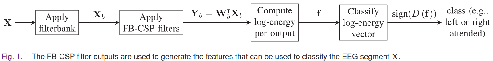

# Data Description

## _Experimental Design_

## _Data Collection_

## _Qulity Evaulation_

# BCI Framework

## Workflow

這次的Project是我們對EEG Audio Attention Decoding任次的首次嘗試分析，使用也是第一次分析NJU Dataset。因此首先嘗試使用過去已有的方法，來對我們感興趣的任務進行實作。我們挑選了兩種方法，Filter Bank CSP以及Learnable spatial mapping CNN model，作為BCI project的主要Feature Extraction和Classification methods。

CSP作為常用在EEG分析的方法

## _Feature Extraction_
| CSP | Filter Bank (FB) CSP | Channel Selection + Frequency Domain | 
|------|------|------|

## _Classification Model_
| __FB CSP + SVM__ | FB CSP + LDA | FB CSP + Decision Tree | Learnable Sptail Mapping CNN|
|------|------|------|------|

## _Validation_

- __Leave One Group Out__

## _Result_

1. **±90 Classification with Different Band CSP**

    | Filter Bands (1172) | FB CSP + SVM | FB CSP + LDA | FB CSP + Decision Tree |
    |:-:|:-:|:-:|:-:|
    |Filter Bank (1~40, 14 Bank)|58.0±8.4|56.2±8.5|56.2±11.1|
    |1−4 Hz (δ)|55.5±3.3|52.6±3.3|52.2±6.4|
    |4−8 Hz (θ)|56.1±3.0|55.0±2.3|54.4±4.6|
    |8−12 Hz (α)|54.0±9.6|57.9±7.4|56.7±5.8|
    |12~20 Hz|66.2±7.5|56.7±5.9|53.2±7.5|
    |Filter Bank (12~22, 4 Bank)|62.4±6.6|57.1±3.3|58.0±4.5|
    |12−30 Hz (β)|56.7±1.6|57.7±9.1|57.3±8.3|

2. **Different Direction**

    The attention angel in NJU dataset have 15 direction we choice the all 對應的角度來預測 (ex. -90/90, -30/30, ...). And is a binary classification the label with left and right.

    **Note**: FB CSP with Filter bank in 12~22 hz, and each band 4 hz with overlap 2 hz.

    | Direction (Segments numbers) | FB CSP + SVM | FB CSP + LDA | FB CSP + Decision Tree | Learnable Sptail Mapping CNN|
    |:-:|:-:|:-:|:-:|:-:|
    | All (6653)|49.5±1.4|48.8±2.6|48.6±1.7|54.4±1.7|
    | ±90 (1172)|**62.4±6.6**|**57.1±3.3**|**58.0±4.5**|**58.6±4.6**|
    | ±60 (1235)|47.9±5.3|48.9±6.6|47.4±5.6|53.3±2.1|
    | ±45 (1205)|40.7±5.6|44.2±7.1|48.6±11.0|52.8±3.1|
    | ±30 (1141)|38.6±10.0|35.8±11.0|44.7±6.5|52.6±3.1|

3. **Decision Windows**

   **Note**: FB CSP with Filter bank in 12~22 hz, and each band 4 hz with overlap 2 hz.

    | Window Size (Segments numbers) | FB CSP + SVM | FB CSP + LDA | FB CSP + Decision Tree | Learnable Sptail Mapping CNN|
    |:-:|:-:|:-:|:-:|:-:|
    |10 (476)|**63.4±8.0**|58.4±6.9|51.7±6.9|58.6±4.6|
    |4 (1172)|**62.4±6.6**|57.1±3.3|58.0±4.5|58.6±4.6|
    |2 (2380)|**59.3±6.7**|56.6±3.5|55.8±6.7|59.2±5.5|
    |1 (4760)|**57.7±6.8**|56.6±3.2|56.8±5.5|55.6±5.2|

## _Usage and Demo Video_